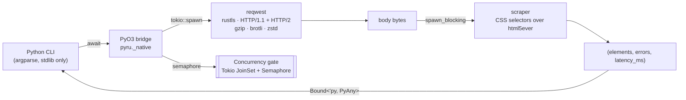

# PyRu

> A low-latency, zero-Python-dependency web scraper CLI — Rust engine,
> async end-to-end, stdlib-only front-end.

<p align="center">
  <a href="https://github.com/afadesigns/pyru/actions/workflows/ci.yml">
    
  </a>
  <a href="https://api.securityscorecards.dev/projects/github.com/afadesigns/pyru">
    
  </a>
  <a href="https://pypi.org/project/pyru-scraper/">
    
  </a>
  <a href="#license">
    
  </a>
  
  
</p>

```
pyru scrape "https://example.com" -s "h1" -o json
```

---

## Table of contents

| [Design](#design) · [Install](#install) · [Usage](#usage) · [API](#python-api) · [Benchmarks](#benchmarks) · [Security](#security) · [Develop](#develop) · [License](#license) |
| -- |

## Design



- **One async Python entry point.** The CLI hands a batch of URLs to a
  single `await scrape_urls_concurrent(...)` call. Everything below the
  await lives in Rust.
- **Per-URL error reporting.** A failing URL emits an error string in its
  slot; the rest of the batch keeps flowing. No early-exit semantics.
- **Tuned `reqwest` client.** TCP_NODELAY, 30 s keep-alive, bounded
  idle pool, configurable timeouts, 10-redirect cap, HTTP/2 negotiated
  when the peer supports it.
- **Parse off the reactor.** HTML goes through `scraper` inside
  `tokio::task::spawn_blocking` so the async runtime stays responsive
  even when a page is a 5 MB `<div>` soup.
- **MiMalloc global allocator.** ~10–20 % fewer allocations on the hot
  path vs glibc's default.

## Install

```bash
pip install pyru-scraper
```

> [!NOTE]
> Pre-built `abi3` wheels are published for x86_64 Linux (manylinux 2.28),
> Intel + Apple Silicon macOS, and x86_64 Windows. A source distribution
> is available; building it requires a stable Rust toolchain
> (`rustup default stable`) and CPython 3.15+.

## Usage

```bash
pyru scrape [OPTIONS] URL [URL...]
```

| Flag                        | Default       | Description                                    |
| --------------------------- | ------------- | ---------------------------------------------- |
| `-s, --selector TEXT`       | *(required)*  | CSS selector applied to each fetched page.     |
| `-o, --output {json,text}`  | `text`        | Output format.                                 |
| `-c, --concurrency INT`     | `50`          | Maximum in-flight requests (1–10 000).         |
| `-u, --user-agent TEXT`     | built-in      | Override the default `User-Agent`.             |
| `--timeout-ms INT`          | `10000`       | Total per-request timeout (milliseconds).      |
| `--connect-timeout-ms INT`  | `5000`        | TCP/TLS connect timeout (milliseconds).        |

```bash
pyru scrape "https://books.toscrape.com/" -s "h3 > a" -c 200 -o json
```

<details>
<summary><strong>Worked example: 50 pages, JSON piped to <code>jq</code></strong></summary>

```bash
$ pyru scrape $(seq 1 50 | xargs -I{} echo "https://books.toscrape.com/catalogue/page-{}.html") \
    -s "h3 > a" -c 25 -o json \
  | jq -s '[.[] | {url, latency_ms, n: (.elements | length)}]'
```

</details>

## Python API

```python
import asyncio
from pyru import scrape_urls_concurrent


async def main() -> None:
    elements, errors, latency_ms = await scrape_urls_concurrent(
        urls=[
            "https://example.com/",
            "https://example.org/",
        ],
        selector="h1",
        concurrency=8,
        timeout_ms=5_000,
    )
    for url, els, err, lat in zip(
        ["https://example.com/", "https://example.org/"],
        elements, errors, latency_ms,
        strict=True,
    ):
        marker = "ok" if not err else f"err={err!r}"
        print(f"{url}  {lat:>4} ms  {marker}  -> {els}")


asyncio.run(main())
```

The `_native` module exports a single async function:

```python
async def scrape_urls_concurrent(
    urls: Sequence[str],
    selector: str,
    concurrency: int = 50,
    user_agent: str | None = None,
    timeout_ms: int = 10_000,
    connect_timeout_ms: int = 5_000,
) -> tuple[list[list[str]], list[str], list[int]]: ...
```

## Benchmarks

A self-contained harness under [`benchmarks/`](benchmarks/) spins up a
local `aiohttp` server and compares PyRu against the most-commonly-cited
pure-Python alternative (`httpx + selectolax`). Numbers vary wildly with
hardware, kernel tunables (`net.ipv4.tcp_tw_reuse`, `tcp_fin_timeout`,
file descriptor limits), and test concurrency — **run it yourself** and
publish the raw output before quoting comparisons.

```bash
uv sync --group benchmarks
uv run python benchmarks/real_world_benchmark.py
```

> [!WARNING]
> Benchmark results published before running the harness on your
> hardware should be treated as anecdotes, not data. See [#benchmarks]
> in the [contributor guide](CONTRIBUTING.md) for how to publish fair
> numbers.

## Security

See [`SECURITY.md`](SECURITY.md) for responsible disclosure and our
supply-chain posture. Highlights:

- **Zero runtime Python dependencies.** The CLI is stdlib-only.
- **In-tree PEP 517 build backend** at [`_build/`](_build/) — no
  `setuptools`, no `hatchling`, no `maturin`.
- **Rust audit** (`cargo deny check advisories bans sources`) runs on
  every CI build.
- **Trusted publishing** (OIDC) to PyPI — no API tokens on file.
- **Signed commits** are enforced on `main`.

## Develop

```bash
uv python install 3.15
uv sync --group dev                         # ruff + ty
uv pip install -e .                         # builds the native ext via cargo
```

Then the full check chain:

```bash
uv run ruff check
uv run ruff format --check
uv run ty check
uv run python -m unittest discover -s tests -v

cargo fmt  --manifest-path native/Cargo.toml --all -- --check
cargo clippy --manifest-path native/Cargo.toml --all-targets -- -D warnings
cargo test   --manifest-path native/Cargo.toml --all-targets
```

Layout at a glance:

```
.
|- pyru/            Python package (argparse CLI + type stubs)
|- native/          Rust crate (pyo3, tokio, reqwest, scraper)
|- _build/          PEP 517 build backend (stdlib only)
|- tests/           stdlib unittest suite
|- benchmarks/      opt-in comparison harness
```

## License

MIT — see [`LICENSE`](LICENSE). Copyright © Andreas Fahl.
